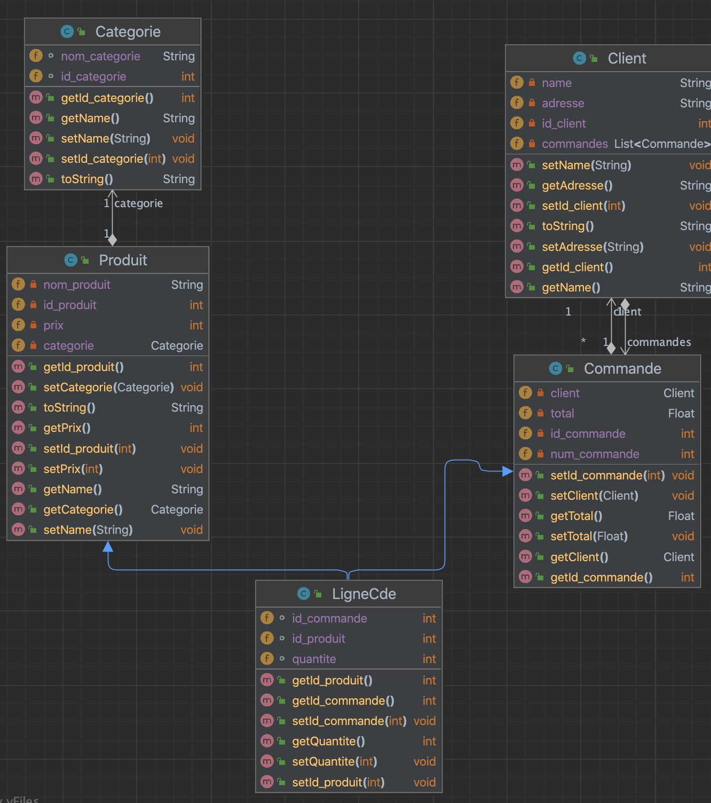
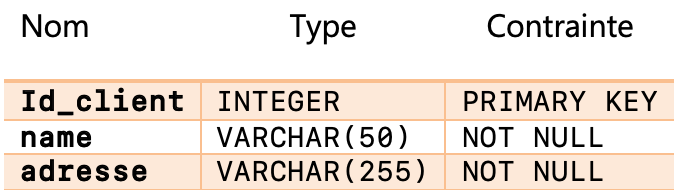
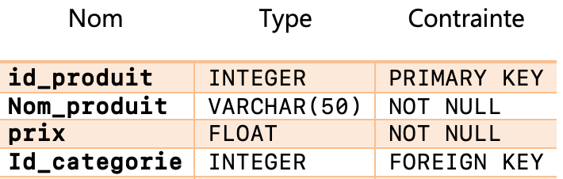
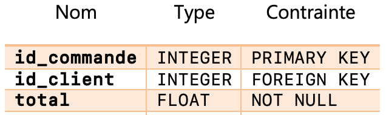
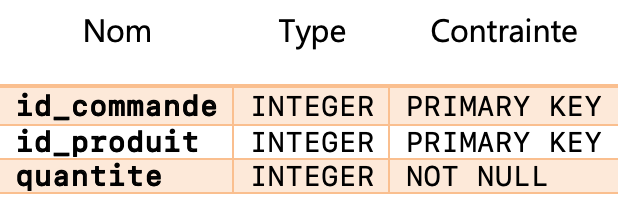
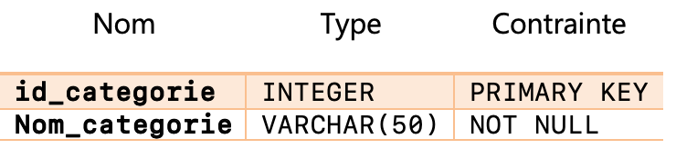

# JavaFxDB

Activité pratique : accès aux bases de données et JAVAFX

## Diagramme de classe 

## Tables dans la base de données
Table Client

Table Produit

Table Commande

Table LigneCommande

Table Categorie

		

